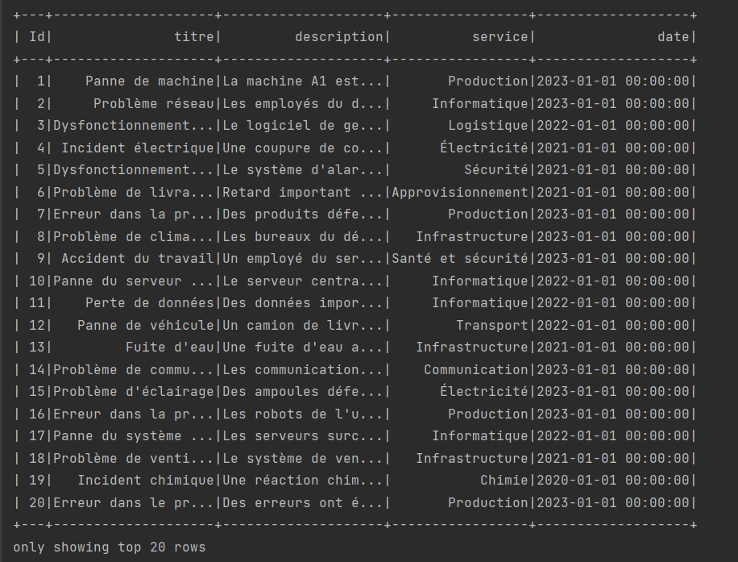
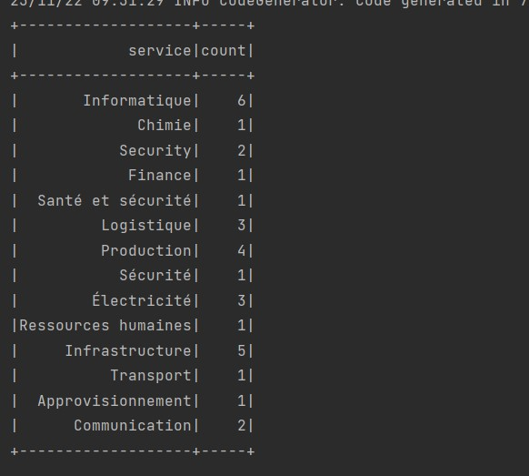
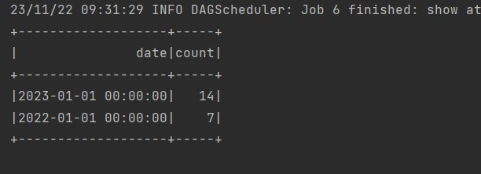
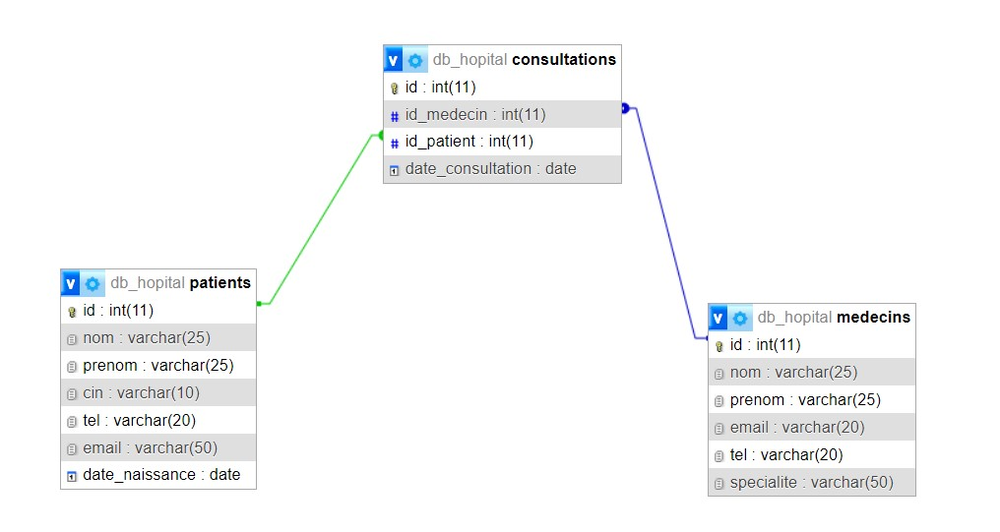
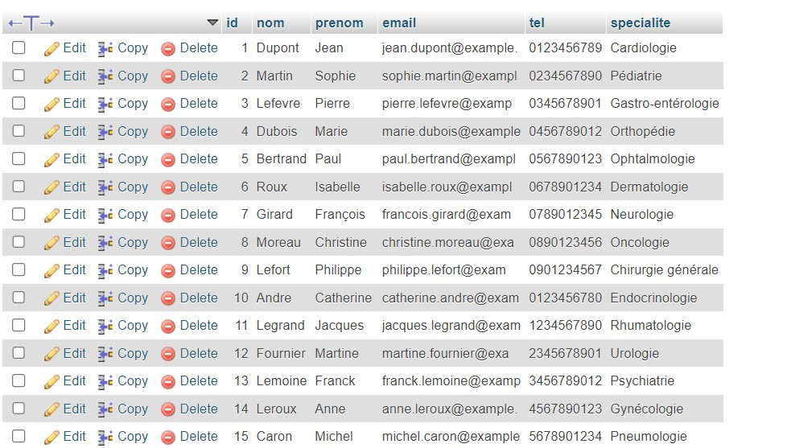
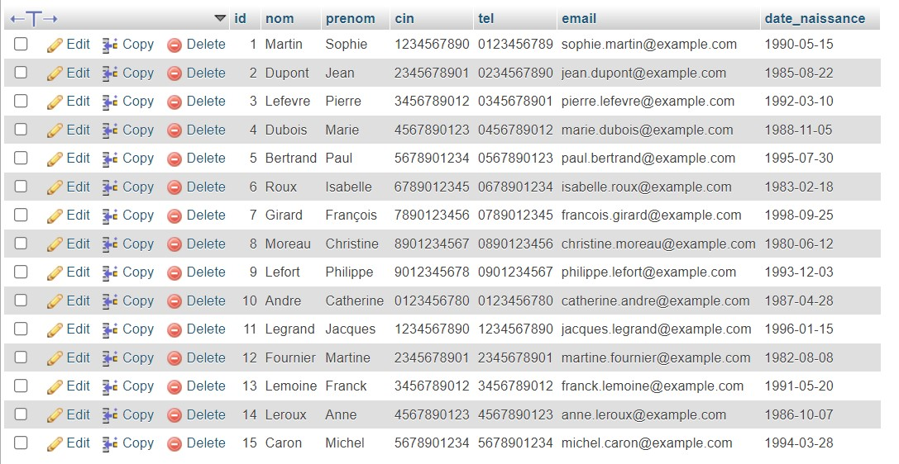
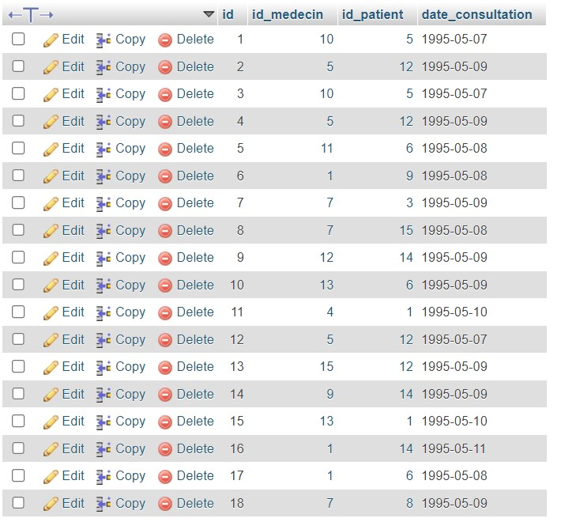
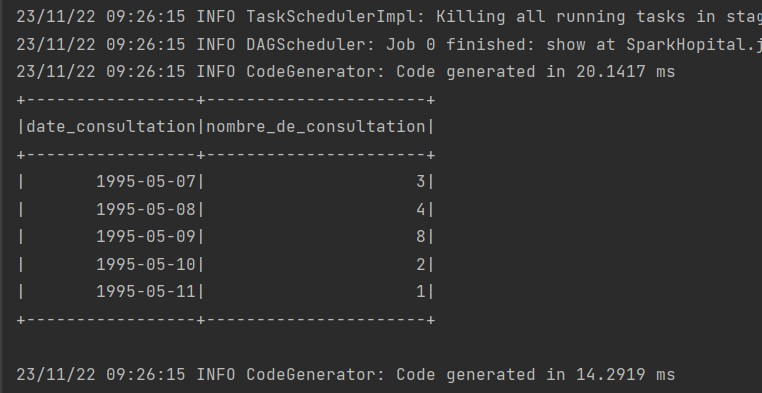
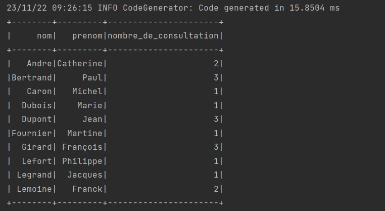

# big_data_tp5_sparksql

#### Exercice 1 :
On souhaite développer pour une entreprise industrielle une application Spark qui traite les
incidents de chaque service. Les incidents sont stockés dans un fichier csv.
Le format de données dans les fichiers csv et la suivante :
 Id, titre, description, service, date
 Travail à faire :
1. Afficher le nombre d’incidents par service.
  - Voici un apperçu de la base de donnée : 
    - 
  - Le nombre d’incidents par service
    - 
   
2. Afficher les deux années où il a y avait plus d’incidents.
  - 

### Exercice 2 :
L’hôpital national souhaite traiter ces données au moyen d’une application Spark d’une
manière parallèle est distribuée. L’hôpital possède des données stockées dans une base de
données relationnel et des fichiers csv. L’objectif est de traiter ces données en utilisant Spark
SQL à travers les APIs DataFrame et Dataset pour extraire des informations utiles afin de
prendre des décisions.
I. Traitement de données stockées dans Mysql
L’hôpital possède une application web pour gérer les consultations de ces patients, les
données sont stockées dans une base de données MYSQL nommée DB_HOPITAL, qui
contient trois tables PATIENTS, MEDECINS et CONSULTATIONS.

- Voici une architecture de la base de donnée db_hopital :
  - 
      
Travail à faire :
Vous créez la base de données et les tables et vous répondez aux questions suivantes :
- Contenus de la table medecins
    - 
- Contenus de la table patients
    - 
- Contenus de la table consultations
    - 

      
- Afficher le nombre de consultations par jour.
  - 

- Afficher le nombre de consultation par médecin. Le format d’affichage est le suivant :
 NOM | PRENOM | NOMBRE DE CONSULTATION
   - 
